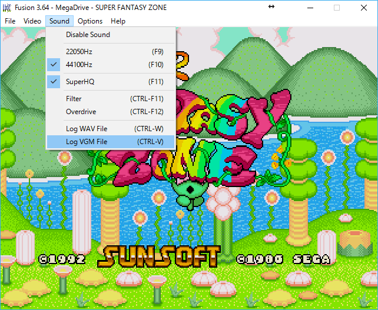
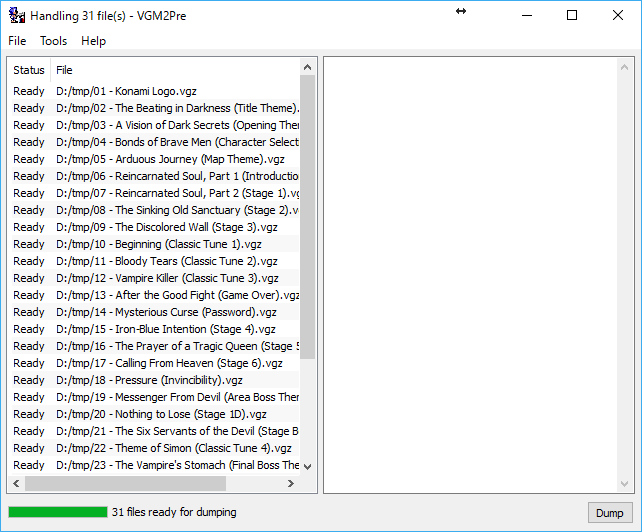
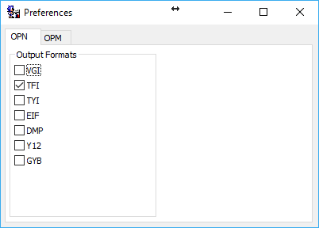
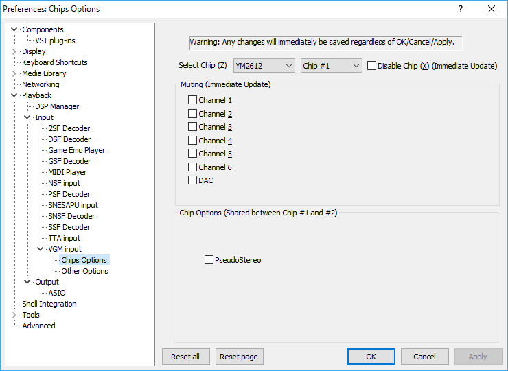
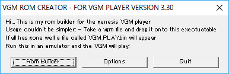
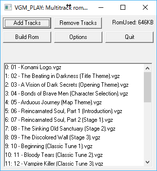
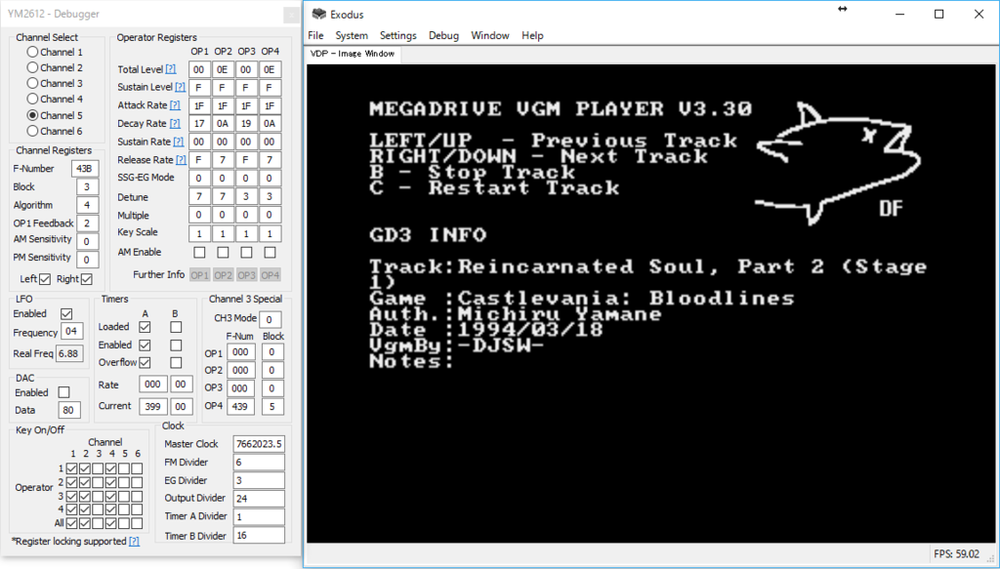

# Guide for Extracting FM Synth Presets of Sega Genesis

This article explains some methods useful for viewing or dumping FM synthsis parameters (i.e. register values) of Sega Genesis sound chips.

This article covers the methods for YM2612 (aka. OPN2, the FM synth chip of Genesis), but some of informations can apply to SN76489 (the DCSG chip) too.

* Dump VGM file by [Kega Fusion](http://segaretro.org/Kega_Fusion)
* Extract instrument presets from VGM file by [vgm2pre](https://vgmrips.net/wiki/Vgm2pre)
* Play VGM file and mute channels by [foo_input_vgm](https://vgmrips.net/forum/viewtopic.php?p=5638#p5638)
* Convert VGM file into Genesis ROM by [VGMPlayer](http://www.smspower.org/maxim/SMSSoftware/VGMPlayer)
* View register values in real-time with [Exodus](http://www.exodusemulator.com/)

## Dump VGM file by Kega Fusion

[Kega Fusion](http://segaretro.org/Kega_Fusion), a good Genesis emulator, is able to log sound during the game play as [VGM file](https://en.wikipedia.org/wiki/VGM_(file_format)).

If you want to read a detailed ripping guide, see [Project2612 ripping tutorial](https://vgmrips.net/wiki/Project2612_ripping_tutorial).

## Extract instrument presets from VGM file by vgm2pre

[vgm2pre](https://vgmrips.net/wiki/Vgm2pre) is a small tool for extracting instrument presets from VGM file.

There are various formats for an instrument preset. Output file format can be chosen from Preferences window (Tools › Preferences).

[TFI](https://vgmrips.net/wiki/TFI_File_Format) is prefered for [FMDrive from Aly James Lab](http://www.alyjameslab.com/alyjameslabfmdrive.html). Please choose the one that suits your goal.

By pressing Dump button, the output file will be saved. You can load the file by a proper tool or VST plugin, or view it by hex viewer, since the TFI file format is quite simple.

## Play VGM file and mute channels

I prefer to use [foobar2000](http://www.foobar2000.org/) with [foo_input_vgm](https://vgmrips.net/forum/viewtopic.php?p=5638#p5638). You are able to mute certain channels from Preferences panel.

If you want to try other ones, see [VGM Players \- vgmrips](https://vgmrips.net/wiki/VGM_Players).

## Convert VGM file into Genesis ROM by VGM Player

[VGMPlayer](http://www.smspower.org/maxim/SMSSoftware/VGMPlayer) allows you to convert the VGM log into a music player ROM.

Main window will appears by pressing the ROM Builder button.

Add VGM files by the Add Tracks button first, then press Build Rom button, and a file named vgmPlay.bin will be saved. That is the converted ROM image.

## View register values in real-time with Exodus

Sometimes you might want to view register values in real-time. [Exodus](http://www.exodusemulator.com/), an awesome emulator features a lot of debugger functions, is able to display the sound register values in real-time.

Open a ROM and the YM2612 debugger (from the menu, Debug › Mega Drive › YM2612), then you will see register values there.

## Credits

99% of this article is the translation from the following [gocha](https://github.com/gocha)'s article. I appreciate it very much.

[メガドライブの音源の音色設定（レジスタ値）を確認・ダンプする](http://gocha.hatenablog.com/entry/How_To_Dump_Genesis_YM2612_Registers)
