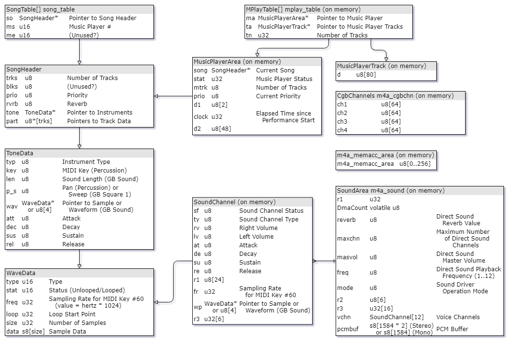

# Summary of GBA standard sound driver (MusicPlayer2000)

Nintendo's Game Boy Advance SDK comes with a sound driver library for playing music and sound effects in the game.
This driver is officially called MusicPlayer2000 or m4a and is often informally also called Sappy.

Inevitably, MP2k is used in a large number of games (especially in games released in Japan).
Also, since it has been analyzed by many people for a long time, there is a great deal of analysis information and tools.

This article does not explain the details of MP2k. Instead, this article introduces you an overview of MP2k and various resources to learn more.

[日本語で読む](Summary_of_GBA_Standard_Sound_Driver_MusicPlayer2000.ja-JP.md)

## MusicPlayer2000 Specifications Overview

Almost everything is explained in the following document:

[Romhacking.net - Documents - GBA "Sappy" sound engine information](https://www.romhacking.net/documents/462/)

To summarize the main explanation MP2k has the following features.

* Software-synthesized PCM sound (DirectSound) + Gameboy compatible sound available
* PCM sound (DirectSound)
  * Playback frequency is selectable between 5734 Hz and 42048 Hz (default is 13379 Hz)
  * The number of channels is selectable between 1 and 12 (default is 8)
  * ADSR is configurable per instrument (resolution is 8-bit)
  * Resampling with linear interpolation
  * Equipped with a simple reverb (echo) effect with fixed delay
  * The processing speed and output quality of the mixer are not very good (refer to the above-mentioned document for details)
* Gameboy compatible sound
  * 2 square waves + 1 programmable waveform + 1 noise
* Data format
  * Convert MIDI / AIFF file to assembly (*.s) and build GBA ROM
  * Sequences are multitrack format like SMF Format 1 (PPQN is 24)
  * Samples are uncompressed 8-bit PCM (note that they have the opposite sign to Microsoft Wave)
  * There is no distinction between BGM and SFX. All sounds consist of sequence + bank combinations

In fact, this standard sound driver is also implemented in the System ROM (BIOS). However, those system functions are almost never used in actual commercial games, because the MP2k driver has been released as a compatible driver with bugfixes and improvements. See [GBATEK](https://problemkaputt.de/gbatek.htm) for GBA BIOS functions.

## Versions and variations

As far as I know, MP2k has the following standard variations:

|Description    |Example of games using the driver                                  |
|---------------|-------------------------------------------------------------------|
|Older version  |Momotarou Matsuri (and probably some other games released in 2001) |
|Stereo version |Castlevania: Circle of the Moon                                    |
|Mono version   |Castlevania: Harmony of Dissonance and Aria of Sorrow              |
|Newer version? |Mega Man Battle Network 5, Puyo Pop Fever, Mother 3                |

Note: Minor version differences are considered identical here.

Also, some games use compatible drivers that improve and extend MP2k.

* Pokemon Series (uses compressed samples)
* Games developed by Camelot, Inc., such as the Golden Sun
* Metroid Fusion and Metroid Zero Mission
* etc.

## Basic use of MusicPlayer2000 driver functions

The driver basically works with 4 functions.

First, the m4aSoundInit function must be called in the initialization routine to initialize the sound.

```c
void m4aSoundInit(void);
```

The VBlank interrupt handler must call the m4aSoundVSync function immediately after the interrupt.

```c
void m4aSoundVSync(void);
```

The m4aSoundMain function must be called by main routine in every frame (approximately every 1/60 of a second).

```c
void m4aSoundMain(void);
```

Lastly, call the m4aSongNumStart function with a song number to start playing.

```c
void m4aSongNumStart(u16 n);
```

The addresses of these functions can usually be detected with saptapper, an automated ripping tool for MP2k.

[loveemu/saptapper: Automated GSF ripper](https://github.com/loveemu/saptapper)

## ROM / RAM data map



See [m4a_internal.h](https://github.com/pret/pokeruby/blob/master/include/gba/m4a_internal.h) and [sappy.txt](https://www.romhacking.net/documents/462/) for more informations.

## List of commands of MusicPlayer2000 sequence

The table below shows a list of MP2k sequence commands.

In principle, most of 1-byte arguments are values in the range 0 to 127, and values greater than 0x80 are not used.

|Command      |Symbol     |Parameters                              |Repeatable |Description                                                                         |
|-------------|-----------|----------------------------------------|-----------|------------------------------------------------------------------------------------|
|0x00 ～ 0x7F |n/a        |n/a                                     |Yes        |Repeat previous repeatable command using the command byte as first argument         |
|0x80 ～ 0xB0 |W00 ～ W96 |void                                    |No         |Delta-time (Wait)                                                                   |
|0xB1         |FINE       |void                                    |No         |Track end                                                                           |
|0xB2         |GOTO       |u32 dest                                |No         |Jump to specified address (absolute hardware address like 0x8XXXXXX)                |
|0xB3         |PATT       |u32 dest                                |No         |Pattern start (subroutine jump, cannot be nested)                                   |
|0xB4         |PEND       |void                                    |No         |Pattern end                                                                         |
|0xB5         |REPT       |u8 count, u32 dest                      |No         |Repeat pattern (the valid range for the repeat count is 0-255)                      |
|0xB9         |MEMACC     |u8 mem_set, u8 adr, u8 dat [, u32 dest] |No         |Memory access (used for dynamic conditional jumps; details below)                   |
|0xBA         |PRIO       |u8                                      |No         |Priority of track (0-255, the higher the value, the higher priority)                |
|0xBB         |TEMPO      |u8                                      |No         |Tempo, specify half the value of BPM (11-255, 1 frame = 1 tick in case of tempo 75) |
|0xBC         |KEYSH      |s8                                      |No         |Transpose (-128-127, per-track transpose)                                           |
|0xBD         |VOICE      |u8                                      |Yes        |Instrument                                                                          |
|0xBE         |VOL        |u8                                      |Yes        |Volume                                                                              |
|0xBF         |PAN        |u8                                      |Yes        |Pan (0: left, 64: center, 127: right)                                               |
|0xC0         |BEND       |u8                                      |Yes        |Pitch bend (0-127, center is 64)                                                    |
|0xC1         |BENDR      |u8                                      |Yes        |Pitch bend range (specified in semitones, default is 2)                             |
|0xC2         |LFOS       |u8                                      |No         |LFO speed (higher values are faster, actual speed fluctuates with tempo)            |
|0xC3         |LFODL      |u8                                      |No         |LFO delay (specified in ticks)                                                      |
|0xC4         |MOD        |u8                                      |Yes        |LFO depth                                                                           |
|0xC5         |MODT       |u8                                      |No         |LFO type (0: pitch (default), 1: volume, 2: pan)                                    |
|0xC8         |TUNE       |u8                                      |Yes        |Micro-tuning (0: one semitone lower, 64: normal: 127: one semitone higher）         |
|0xCD 0x08    |XCMD xIECV |u8                                      |Yes        |Pseudo-echo volume (0-127)                                                          |
|0xCD 0x09    |XCMD xIECL |u8                                      |Yes        |Pseudo-echo length (0-127, specified in frame counts (i.e. xx/60 seconds))          |
|0xCE         |EOT        |[u8 key]                                |Yes        |Tie end / Note off                                                                  |
|0xCF         |TIE        |[u8 key [, u8 velo]]                    |Yes        |Tie / Note on (note length is undeterminated until the 0xCE command appears)        |
|0xD0 ～ 0xFF |N01 ～ N96 |[u8 key [, u8 velo [, u8 gtp]]]         |Yes        |Note (the third argument is for fine adjustment of gate time, specified in ticks)   |

### Note

The Wxx command (0x80 to 0xB0) and the Nxx command (0xD0 to 0xFF) represent lengths from 1 to 96. The lookup table below shows the list of lengths.

```c
const u8 noteLengthTable[48] = {
   1,  2,  3,  4,  5,  6,  7,  8,  9, 10, 11, 12, 13, 14, 15, 16,
  17, 18, 19, 20, 21, 22, 23, 24, 28, 30, 32, 36, 40, 42, 44, 48,
  52, 54, 56, 60, 64, 66, 68, 72, 76, 78, 80, 84, 88, 90, 92, 96
};
```

### Memory access (MEMACC)

MEMACC (0xB9) is a command to perform a conditional jump dynamically according to the state of the game. The command uses a shared memory area (up to 256 bytes of RAM area `m4a_memacc_area`). This command is rarely used.

This command basically takes three arguments, except that the conditional branch instruction specifies the branch destination address as the fourth argument.

```asm
@ for arithmetic operations
MEMACC, mem_set, adr, dat

@ for branching instructions
MEMACC, mem_set, adr, dat, dest
```

Specify the type of operation with mem_set, and specify the arguments of the operation with adr and dat (0-255).

Specify one of the following values for mem_set:

|Value |Symbol      |Description                              |Pseudo syntax                 |
|------|------------|-----------------------------------------|------------------------------|
|0     |mem_set     |Assign (Immediate)                       |`$adr = #dat`                 |
|1     |mem_add     |Add (Immediate)                          |`$adr += #dat`                |
|2     |mem_sub     |Subtract (Immediate)                     |`$adr -= #dat`                |
|3     |mem_mem_set |Assign (Indirect)                        |`$adr = $dat`                 |
|4     |mem_mem_add |Add (Indirect)                           |`$adr += $dat`                |
|5     |mem_mem_sub |Subtract (Indirect)                      |`$adr -= $dat`                |
|6     |mem_beq     |Branch if equal (Immediate)              |`if ($adr == #dat) goto dest` |
|7     |mem_bne     |Brnach if not equal (Immediate)          |`if ($adr != #dat) goto dest` |
|8     |mem_bhi     |Branch if higher (Immediate)             |`if ($adr > #dat) goto dest`  |
|9     |mem_bhs     |Branch if higher or the same (Immediate) |`if ($adr >= #dat) goto dest` |
|10    |mem_bls     |Branch if lower of the same (Immediate)  |`if ($adr <= #dat) goto dest` |
|11    |mem_blo     |Branch if lower (Immediate)              |`if ($adr < #dat) goto dest`  |
|12    |mem_mem_beq |Branch if equal (Indirect)               |`if ($adr == $dat) goto dest` |
|13    |mem_mem_bne |Brnach if not equal (Indirect)           |`if ($adr != $dat) goto dest` |
|14    |mem_mem_bhi |Branch if higher (Indirect)              |`if ($adr > $dat) goto dest`  |
|15    |mem_mem_bhs |Branch if higher or the same (Indirect)  |`if ($adr >= $dat) goto dest` |
|16    |mem_mem_bls |Branch if lower of the same (Indirect)   |`if ($adr <= $dat) goto dest` |
|17    |mem_mem_blo |Branch if lower (Indirect)               |`if ($adr < $dat) goto dest`  |

## List of known functions

```c
void m4aSoundVSync(void);
void m4aSoundInit(void);
void m4aSoundMode(u32 mode);
void m4aSoundMain(void);
void m4aSongNumStart(u16 n);
void m4aMPlayStart(MusicPlayerArea *ma, SongHeader *so);
void m4aSongNumStartOrChange(u16 n);
void m4aSongNumStartOrContinue(u16 n);
void m4aSongNumStop(u16 n);
void m4aMPlayStop(MusicPlayerArea *ma);
void m4aSongNumContinue(u16 n);
void m4aMPlayAllStop(void);
void m4aMPlayContinue(MusicPlayerArea *ma);
void m4aMPlayAllContinue(void);
void m4aMPlayFadeOut(MusicPlayerArea *ma, u16 sp);
void m4aMPlayImmInit(MusicPlayerArea *ma);
void m4aSoundVSyncOff(void);
void m4aSoundVSyncOn(void);
void m4aMPlayTempoControl(MusicPlayerArea *ma, u16 te);
void m4aMPlayVolumeControl(MusicPlayerArea *ma, u16 tb, u16 vo);
void m4aMPlayPitchControl(MusicPlayerArea *ma, u16 tb, s16 pi);
void m4aMPlayPanpotControl(MusicPlayerArea *ma, u16 tb, s8 pa);
void m4aMPlayModDepthSet(MusicPlayerArea *ma, u16 tb, u8 md);
void m4aMPlayLFOSpeedSet(MusicPlayerArea *ma, u16 tb, u8 ls);
```

## Documents

[Romhacking.net - Documents - GBA "Sappy" sound engine information](https://www.romhacking.net/documents/462/) (by Bregalad, ipatix)

## Tools and Source Codes

* [ipatix/agbplay: Music player for the most common GBA sound format](https://github.com/ipatix/agbplay)
  * Music player for PC that can play MP2k format (LGPLv3)
  * The source code will be helpful in understanding the driver (see StreamGenerator.cpp for sequence parser)
  * ipatix is one of the prominent MP2k analysts, and his github also has other MP2k tools such as m4a2s, midi2agb and wav2agb. They are useful for ROM hacking etc.
* [Kermalis/VGMusicStudio: A program that lets you listen to the music from popular video game formats.](https://github.com/Kermalis/VGMusicStudio)
  * New music player and visualizer for GBA music format, written in C# (LGPLv3)
* [loveemu/saptapper: Automated GSF ripper](https://github.com/loveemu/saptapper) (A reimplementation of Caitsith2's saptapper)
  * Automated GSF ripping tool for MP2k
  * It can also be used to detect fundamental m4a functions
  * Forked from: [GSF Ripping Tools - caitsith2.net](http://gsf.caitsith2.net/ripping.html)
* [jpmac26/gba-mus-ripper: A fork of Bregalad's "GBA Mus Riper" program](https://github.com/jpmac26/gba-mus-ripper)
  * Conversion tool that can export MP2k format to MIDI/SF2 format
  * sappy_detector.exe can be used to detect MP2k driver and view some basic information
  * Forked from: [Utilities - GBA Mus Riper - Romhacking.net](https://www.romhacking.net/utilities/881/)
* [pret/pokeruby: Disassembly of Pokémon Ruby/Sapphire](https://github.com/pret/pokeruby)
  * Actual example of music data
  * [m4a_internal.h](https://github.com/pret/pokeruby/blob/master/include/gba/m4a_internal.h) is a good representation of the internal data structure of MP2k
* [IDA FLIRT Signatures for GBA](https://1drv.ms/u/s!Alr6ACx5YY7_gjYggbVU-MQwJIlj?e=xR1rZD) (experimental)
